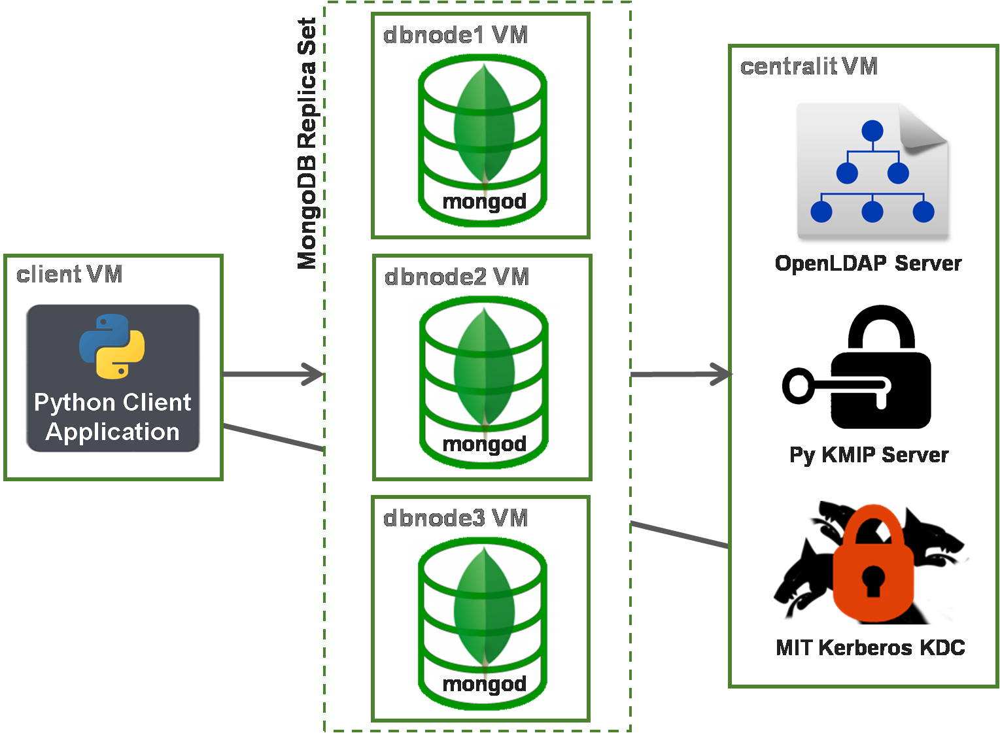

# MongoSecurityPlaypen

MongoSecurityPlaypen is intended to be used for learning, exploring or demo'ing specific [MongoDB security](https://docs.mongodb.com/manual/security/) features, to be deployed only in a safe sandbox environment. The project uses [VirtualBox](https://www.virtualbox.org/), [Vagrant](https://www.vagrantup.com/) & [Ansible](https://www.ansible.com/) to create, configure and run a set of virtual machines on a host Laptop/PC.

**WARNING** *This project is intentionally NOT "production secure" to make it easier for people to explore. For example, no firewalls are configured and passwords are passed around on the command line which can be view-able in OS user history and OS process lists. Other potential security holes are likely to exist. It is strongly suggested that you consult the [MongoDB Security Checklist](https://docs.mongodb.com/manual/administration/security-checklist/).* 

The project demonstrates the following MongoDB 3.6 security capabilities.

* __Client Authentication__ - SCRAM-SHA-1, Certificate, LDAP (Proxy & Direct) & Kerberos
* __Internal Authentication__ - Keyfile & Certificate
* __Role Based Access Control__ - Internal-DB & External-LDAP authorization
* __User Access IP Address Whitelists__
* __Auditing__
* __Log Redaction__
* __Encryption-over-the-Wire__ - TLS/SSL
* __Encryption-at-Rest__ - Keyfile & KMIP
* __Secured Views__ - Using custom roles
* __FIPS 140-2 usage__

When the project is run on a Laptop/PC, the following local environment is generated, in a set of 5 Virtual Machines:



**WARNING** *This project is licensed using the open source MIT License (refer to the 'LICENSE' file in the root directory of this project). However, when run, the project will download and install the Enterprise version of MongoDB, supplied by MongoDB Inc., which has a commercial licence. By running the 'vagrant up' command of this MongoSecurityPlaypen project, you will be implicitly accepting the terms and conditions of the MongoDB Enterprise licence enforced by MongoDB Inc.. Please consult MongoDB Inc.'s licence documents directly, for more information.*


## 1  How To Run

### 1.1 Prerequisites

Ensure the following dependencies are already fulfilled on the host Laptop/PC:

* Host operating system is Mac OS X or Linux
* [VirtualBox](https://www.virtualbox.org/wiki/Downloads) is already installed on the host machine
* [Vagrant](https://www.vagrantup.com/downloads.html) is already installed on the host machine
* Ansible is already installed on the host machine (see OS specific installation guides for [Mac OSX](https://valdhaus.co/writings/ansible-mac-osx/) and the many [Linux](http://docs.ansible.com/ansible/intro_installation.html) variants). _Max OS X Hint_: Run "brew install ansible" but if that fails try the "pip" method described in the link
* Host machine is connected to the internet (for the installation/configuration only - once configured, you can re-start the environment offline)

### 1.2 Main Steps to Run

1. Download or Clone this repository (see green "Clone or Download" button at top right of project home page). Example command to clone:

    ```
    $ git clone https://github.com/pkdone/MongoSecurityPlaypen.git
    $ cd MongoSecurityPlaypen
    ```

2. If required, change any values in the text file __vars/external_vars.yml__ to define which __security features should be turned on and off__ (e.g. to enable Kerberos, to enable KMIP)
3. From the terminal/shell, ensure the current directory is the __base directory__ of this MongoSecurityPlaypen project (i.e. the directory containing the file __Vagrantfile__)
4. __Run the following commands__ to configure the 5-virtual-machine environment outlined in the diagram above - includes final step of automatically running the Test Client Python Application and listing the results in the console:

    ```
    $ vagrant destroy -f
    $ vagrant up
    ```

**Notes:**
* May not be necessary to run 'destroy' first, but some users have reported that one of the VMs is not generated when they run 'up', if they don't run 'destroy' first (root cause not yet diagnosed). Also some Mac users have reported that the first time they run this it fails, and thereafter it runs fine.
* It may take around 15 minutes to complete execution, mainly depending on the speed of the host's internet connection.
* If the internet connection is very slow, the build process may fail with an error due to the CentOS/RedHat package manager (yum) timing out when trying to download binaries.
* Once completed, the results from the Test Client Python Application will have been displayed towards the end of the Vagrant output text in the console, showing some data queried from the MongoDB replica set.
* If the configuration process results in an error, run 'vagrant destroy -f' and then try again, as sometimes old environments can get in the way.


## 2  Tips for Exploring & Playing With the Configured Environment

### 2.1 SSH'ing to each of the 5 VMs

    # Connect to the VM hosting OpenLDAP, MIT Kerberos KDC and PyKMIP Server
    $ vagrant ssh centralit

    # Connect to the VM hosting the 1st MongoDB Database Replica in the Replica Set
    $ vagrant ssh dbnode1

    # Connect to the VM hosting the 2nd MongoDB Database Replica in the Replica Set
    $ vagrant ssh dbnode2

    # Connect to the VM hosting the 3rd MongoDB Database Replica in the Replica Set
    $ vagrant ssh dbnode3

    # Connect to the VM hosting the Test Client Python Application
    $ vagrant ssh client

### 2.2 Stopping, Re-starting and Clearing Out The Environment

To shutdown/halt the VMs, allowing them to be re-started at a future time, as is, for use offline, run:

    $ vagrant halt

To restart the VMs (inc. the MongoDB, OpenLDAP, Kerberos & PyKMIP processes) after previously halting it, just run (this won’t attempt to recreate the VMs - the VMs will just be started up again):

    $ vagrant up 

**Note:** Halt/Up doesn't currently work when the 'encryptdb_enabled' variable is true, because the PyKMIP Server is intended for testing purposes only and does not have the capability to persist saved keys to disk (see section 4. Project TODOs, below).

To completely remove the VMs, ready to start all over again with 'vagrant up', run: 

    $ vagrant destroy -f

**Note:** If a different security configuration is required, by changing the values in the text file __vars/external_vars.yml__, the steps of running 'vagrant destroy -f' and then 'vagrant up' need to be executed, to tear down and then re-create the whole environment again. This project does not have a way of allowing just a few existing environment settings to be re-configured on the fly.

### 2.3 Using Mongo Shell to Connect to the Replica Set

Each sub-section below outlines a specific way to connect to the MongoDB cluster, depending on the type of MongoDB authentication that has been configured for the cluster.

**Notes:**
 * Users must connect to the Replica Set from one of the following IP addresses, due to an IP Address Whitelist that has been defined to apply to all database users: 127.0.0.1, 192.168.14.100, 192.168.14.101, 192.168.14.102, 192.168.14.103, 192.168.14.109.
 * For some types of authentication, when connecting via the Mongo Shell, Fully Qualified Domain Names - FQDNs (eg. dbnode1.vagrant.dev), need to be used rather than just hostnames (eg. dbnode1, localhost) or IP addresses (eg. 192.168.14.101, or 127.0.0.1). This is necessary when using Kerberos, Certificates and/or TLS.
 * For some types of authentication, when invoking the Mongo Shell, the 'mongo' command has to be run as the 'mongod' OS user because a referenced file (such as a keyfile/certificate or a Kerberos keytab), has been "locked down" to only be visible to the 'mongod' OS user that runs the 'mongod' OS process. Hence the use of 'sudo' in those cases.

#### 2.3.1 Connect with no authentication enabled

    $ vagrant ssh dbnode1
    $ mongo    # If SSL disabled
    $ mongo dbnode1.vagrant.dev:27017 --ssl --sslCAFile /etc/ssl/mongodbca.pem  # If SSL enabled
    > show dbs

#### 2.3.2 Connect with Username/Password Challenge (SCRAM-SHA-1) authentication

    $ vagrant ssh dbnode1
    $ mongo    # If SSL disabled
    $ mongo dbnode1.vagrant.dev:27017 --ssl --sslCAFile /etc/ssl/mongodbca.pem  # If SSL enabled
    > db.getSiblingDB("admin").auth(
        {
             mechanism: "SCRAM-SHA-1",
             user: "dbmaster",
             pwd:  "adminPa55wd123",
             digestPassword: true
        }
      );
    > show dbs

#### 2.3.3 Connect with Certificate authentication

    $ vagrant ssh dbnode1
    $ sudo -u mongod mongo dbnode1.vagrant.dev:27017 --ssl --sslCAFile /etc/ssl/mongodbca.pem --sslPEMKeyFile /etc/ssl/adminuser_client.pem --sslPEMKeyPassword tlsClientPa55word678
    > db.getSiblingDB("$external").auth(
        {
             mechanism: "MONGODB-X509",
             user: "CN=dbmaster,OU=Human Resources,O=WizzyIndustries,L=London,ST=London,C=GB"
        }
     );
    > show dbs

#### 2.3.4 Connect with LDAP authentication (for both Proxy and Direct mechanisms)

    $ vagrant ssh dbnode1
    $ mongo    # If SSL disabled
    $ mongo dbnode1.vagrant.dev:27017 --ssl --sslCAFile /etc/ssl/mongodbca.pem  # If SSL enabled
    > db.getSiblingDB("$external").auth(
        {
             mechanism: "PLAIN",
             user: "dbmaster",
             pwd:  "adminPa55wd123",
             digestPassword: false
        }
     );
    > show dbs

#### 2.3.5 Connect with Kerberos (GSSAPI) authentication
    $ vagrant ssh dbnode1
    $ sudo -u mongod kinit dbmaster  # Required after running Vagrant 'halt' and then 'up, to obtain a Kerberos ticket again
    $ sudo -u mongod mongo dbnode1.vagrant.dev:27017   # If SSL disabled
    $ sudo -u mongod mongo dbnode1.vagrant.dev:27017 --ssl --sslCAFile /etc/ssl/mongodbca.pem  # If SSL enabled
    > db.getSiblingDB("$external").auth(
        {
             mechanism: "GSSAPI",
             user: "dbmaster@WIZZYINDUSTRIES.COM"
        }
     );
    > show dbs

### 2.4 Investigating the MongoDB Replica Set

SSH to the host for one of the replicas, eg.:

    $ vagrant ssh dbnode1

Each mongod process is running as a service using the generated configuration file /etc/mongod.conf, including Security settings - to view, simply run: 

    $ less /etc/mongod.conf

The output log for each mongod process is viewable at /var/log/mongod/mongod.conf - this needs to viewed as the 'mongod' OS user eg.:

    $ sudo -u mongod less /var/log/mongodb/mongod.log 

If FIPS 140-2 is enabled, this output log file should contain an output line saying: "FIPS 140-2 mode activated"

If Kerberos is enabled, the following file has additional environment variables set to specify the location of the Keytab and debug logging files: /etc/sysconfig/mongod

If Kerberos is enabled, the mongod process will log Kerberos debug info at /var/log/mongodb/krbtrace.log - this needs to viewed as the 'mongod' OS user eg.:

    $ sudo -u mongod less /var/log/mongodb/krbtrace.log

If Log Redaction is enabled, the mongod process will redact messages, to avoid client data being included in the system log messages appended to the mongodb log file at: /var/log/mongodb/mongod.log

If Auditing is enabled, the mongod process will log Audit events in a BSON format to: /var/lib/mongo/auditLog.bson - to view these events, run:

    $ bsondump /var/lib/mongo/auditLog.bson | less

The Auditing parameters, specified in /var/log/mongod/mongod.conf, are configured to just audit "insert" and "find" operations, and to filter out all other types of events, such as replica-set configuration actions, user creation actions, etc.. In the mongod.conf file, look for the "auditLog:" section of the file, plus the "auditAuthorizationSuccess" parameter at the end of the file, to understand how Auditing has been configured.

The database is configured with an admin user and a sample user (see vars/external_vars.yml for the usernames & passwords). To view the different access control settings for these users, start the Mongo Shell (see section 2.3) and then run the command:

    // If authentication based on Username/Password Challenge (SCRAM-SHA-1):
    > db.getSiblingDB("admin").runCommand({usersInfo:1})
    // If authentication based on Certificate / Kerberos / LDAP (configured to use internal DB role memberships for authorization):
    > db.getSiblingDB("$external").runCommand({usersInfo:1})
    
Note: If using LDAP which is configured to use external LDAP groups role memberships for authorization, the command above will not show any users because they are defined completely in LDAP, with no explicit mappings declared in either the "admin" or "$external" database.

The database is also configured with a custom role called 'AppReadOnly', which can be viewed with the following command:

    > db.getSiblingDB("admin").runCommand({rolesInfo:1})

Once authenticated in the Shell (see section 2.3), to see the authenticated user's information including their roles (plus LDAP external authorization mappings, if configured), run the command:

    > db.getSiblingDB("admin").runCommand({connectionStatus:1})

Also, once authenticated in the Shell, some of the system collections can also be queried to see further information about the admin and sample users/roles, including what the client IP address whitelist is, which each of them has been constrained by, for restricting user access to the replica set: 

    // If authentication based on LDAP Direct with dynamic role membership authorization using groups in the LDAP directory:
    > db.getSiblingDB("admin").system.roles.find().pretty()
    // For all other types of authentication:
    > db.getSiblingDB("admin").system.users.find().pretty()

The MongoDB database/collection that is populated with sample data is: 'maindata.people'. To see the contents of the sample database collection, start the Mongo Shell (see section 2.3) and run:

    > use maindata
    > db.people.find().pretty()

Also in the maindata database, is a View called "adults" which shows data from the "people" collection, only where the person's age is greater than or equal to 18. The main database sample user ("jsmith") only has privileges (via a customer role called "AppReadOnly") to see the data from this View and not from any other collections. To see the contents of this View, run:

    > db.adults.find().pretty()

### 2.5 Investigating the OpenLDAP Server

The OpenLDAP process (/usr/sbin/slapd) is running as a service on the 'centralit' VM, listening on port 389.

The LDAP server is populated with the following users and groups via the project file "files/openldap/basedomain.ldif.j2":
* User : cn=dbmaster,ou=Users,dc=WizzyIndustries,dc=com
* User : cn=jsmith,ou=Users,dc=WizzyIndustries,dc=com
* Group: cn=DBAdmin,ou=Groups,dc=WizzyIndustries,dc=com
* Group: cn=AppReadOnly,ou=Groups,dc=WizzyIndustries,dc=com

One of two mechanisms may be being used to allow mongod to query the LDAP server:
* LDAP Proxy: Each mongod is configured to use a Simple Authentication and Security Layer (SASL) unix process running on the same machine. It is the SASL process that is configured (in "/etc/saslauthd.conf") with the connection details of the remote LDAP server. The mongod process is configured to use the LDAP Proxy mechanism via the parameter "setParameter.saslauthdPath" in "/etc/mongod.conf".
* LDAP Direct: A new feature in in MongoDB 3.4. Each mongod is configured to connect directly to the remote LDAP server via its own native LDAP libraries. The mongod process is configured to use the LDAP Direct mechanism via parameters hanging off "security.ldap" in "/etc/mongod.conf".

If using LDAP Proxy based authentication, each database host VM will be running the SASL process, which the local mongod instance will connect to. In this configuration, the LDAP connection can be tested directly from from the host running mongod:

    $ vagrant ssh dbnode1
    $ testsaslauthd -u jsmith -p Pa55word124 -f /var/run/saslauthd/mux -s ldap

If using LDAP Direct based authentication (a new feature in MongoDB 3.4), there is also the option to delegate access control role memberships to external groups defined in the LDAP server. If this is configured (via the "role_membership" parameter in "external_vars.yml), the roles defined for the MongoDB cluster are mapped to the two LDAP groups listed earlier in this document section.

Regardless of whether Proxy or Direct LDAP integration is being used, the 'ldapsearch' tool can be used to look at the contents of the LDAP Directory:

    $ vagrant ssh centralit
    # Show contents of whole directory (password: "ldapManagerPa55wd123"):
    $ ldapsearch -x -W -H ldap://centralit/ -D "cn=Manager,dc=WizzyIndustries,dc=com" -b "dc=WizzyIndustries,dc=com" "(objectclass=*)"
    # Prove ability to bind to the directory with the 'jsmith' sample user (password: "Pa55word124"):
    $ ldapsearch -x -W -H ldap://centralit/ -D "cn=jsmith,ou=Users,dc=WizzyIndustries,dc=com" -b "ou=Users,dc=WizzyIndustries,dc=com" "(uid=jsmith)"

### 2.6 Investigating the MIT Kerberos KDC

The MIT version of a Kerberos Key Distribution Center (KDC) (krb5-server) is running as a service on the 'centralit' VM, listening on port 88

The generated configuration file for the Kerberos server is at: /etc/krb5.conf

The main log file for the KDC is at: /var/log/krb5kdc.log

A keytab of registered principals (just host machines and not users) is generated to the file: /etc/krb5.keytab - this needs to viewed as the 'root' OS user, eg.:

    $ vagrant ssh centralit
    $ sudo klist -k /etc/krb5.keytab

The kadmin.local tool can be used on the host VM to list the principals (registered host machines and registered users), eg.:

    $ vagrant ssh centralit
    $ sudo kadmin.local
    : listprincs
    : quit

### 2.7 Investigating the PyKMIP Server

PyKMIP (a Python implementation of the Key Management Interoperability Protocol) is a server for maintaining keys & certificates and has been developed for testing and demonstration purposes only. It doesn't persist anything to disk (such as stored keys) and as a result if the host 'centralit' VM is restarted, all stored keys are lost.

Version 0.4.0 of PyKMIP is used rather than a later version (e.g. 0.4.1) which appears to have a regression preventing it from working with MongoDB.

PyKMIP is started as a service using a generated file at: /usr/lib/systemd/system/pykmip.service

The wrapper script that runs the PyKMIP python application is at: /sbin/pykmip_server.py

The wrapper script uses syslog for the logging output for PyKMIP, therefore PyKMIP events can be viewed using the command:

    $ vagrant ssh centralit
    $ sudo grep 'PyKMIP' /var/log/messages

The status of the PyKMIP service and some of its output events can also be viewed using the systemctl command, eg.:

    $ vagrant ssh centralit
    $ sudo systemctl status -l pykmip

### 2.8 Investigating the Test Client Python Application

A simple Python client, that uses the PyMongo driver to test the secure connection to the remote replica set and query and print out some data from the database/view maindata.adults, is located in the home directory of the default vagrant OS user in the 'client' VM (ie.: /home/vagrant/TestSecPyClient.py)

The test client application can be simply run, over and over again, by SSH'ing to the 'client' VM and invoking it directly, eg.:

    $ vagrant ssh client
    $ ./TestSecPyClient.py

If Kerberos has been configured, and vagrant halt & up have been run to restart the 'client' VM, when SSH'ing to the VM and BEFORE running the test application application, the OS user must be granted a Kerberos ticket again, using the command (password is "Pa55word124"):

    $ kinit jsmith


## 3  Major Software Packages Installed
* CentOS 7.3
* MongoDB Enterprise latest 3.6.x version (was version 3.6.0 on 05-Dec-2017)
* OpenLDAP (slapd) latest version in CentOS 7.3 Yum Repository (was version 2.4.44-5 on 05-Dec-2017)
* MIT Kerberos KDC (krb5-server) latest version in CentOS 7.3 Yum Repository (was version 1.15.1-8 on 05-Dec-2017)
* PyKMIP version 0.4.0


## 4  Project TODOs
* Some users (Mac only?) reporting that when they run vagrant up for the first time, the creation of 'centralit' is skipped resulting in missing .pem files during configuration of dbnode VMs ('vagrant destroy -f' seems to clear this up). Not yet diagnosed why this is occurring for some users.
* PyKMIP has no built-in persistence, so if vagrant halt and then vagrant up have been run, the mongod replicas won't start properly, if encryption is enabled using KMIP. As a result, vars/external_vars.yml has been changed to use keyfile by default, for encryption-at-rest, to reduce the number of people that hit this issue.
* When generating the Kerberos keytab on the 'centralit' VM, generate separate keytabs for dbnode1, dbnode2 & dbnode3 for better security isolation
* Configure connectivity (both Proxy and Direct) to Open LDAP to use TLS
* Extend the 'yum' timeout duration, to avoid timeout failures when running 'vagrant up' with a slow internet connection.
* Cache the MongoDB Enterprise yum repository's contents locally ready for quicker re-running of 'vagrant up'

